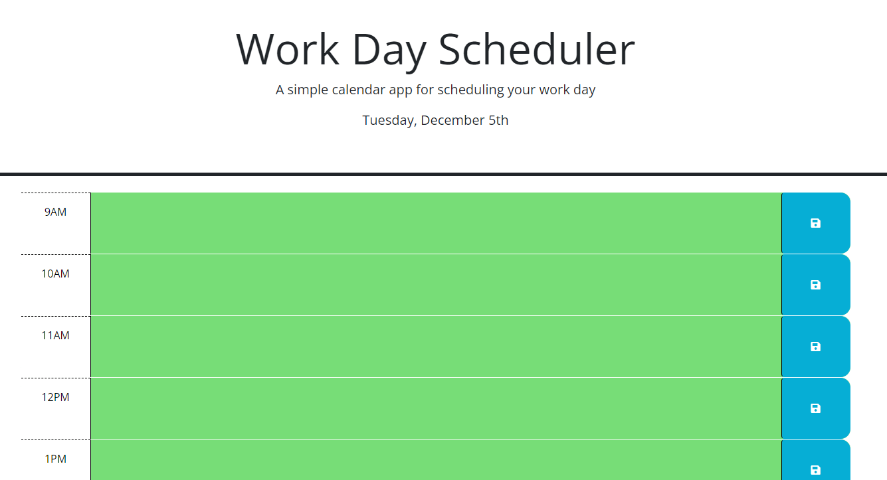

# Daily Planner

## Project description 

For this project, I received a style/design template for the hour blocks, and I had to create them, and dynamically change their background color depending on the current time. I had to create a system that allowed me to save the text in the text area elements locally, and pull that local storage to maintain the content throughout multiple sessions. 

## Installation/Usage

To see the end result, simply visit [Daily-Planner](https://kev-rod43.github.io/daily-planner/). To utilize the app, simply select the timeblock and write whatever notes you would like to save, then press the corresponding save button on the right. 
